# Decision Tree Model: Supervised Learning Classification Algorithm

$\textcolor{orange} {Entropy}$ —— represents the degree of confusion and uncertainty of an object

Entropy function expression :

$$
Entorpy = -\sum_{i = 1}^{n} p(x_i)\log_2p(x_i)
$$

When type A and type B each account for 50% probability : 

$$
Entorpy = -[\frac{1}{2}\log_2(\frac{1}{2}) + \frac{1}{2}\log_2(\frac{1}{2})]= -(-\frac{1}{2} - \frac{1}{2}) = 1
$$

When there is only type A or type B :

$$
Entorpy = -[1 * \log_21 + 0] = -(0 + 0) = 0
$$

When the entropy is maximum 1, it is the state with the worst classification effect. On the contrary, when it is minimum 0, it is the state of complete classification.

$\textcolor{orange}{Information\ Gain}$ —— The measurement method of describing the division effect of test conditions is the difference between the information entropy of the parent node and the weighted average of the information entropy of each leaf node.

$$
Gain(D, a) = Ent(D) - \sum_{i = 1}^{v}\frac{|D_v|}{|D|}Ent(D_v)
$$

$Ent(D)$ is the impurity of the parent node,  $\sum_{i = 1}^{v}\frac{|D_v|}{|D|}Ent(D_v)$​ is the weighted average of the impurity of each branch node under the support of each weight

$\textcolor{orange}{Information\ Gain\ Rate}$ :

$$
Gain_{ratio}(D, A) = \frac{Gain(D, A)}{IV(A)}
$$

$$
IV(A) = - \sum_{i = 1}^{v}\frac{|D_v|}{|D|}\log_2\frac{|D_v|}{|D|}
$$

IV(A) is called intrinsic value, actually is the purity of attribute A

## DEMO06_DECISION_TREE_SIMPLE_FOR_PYTHON

```python
# 导包
import numpy as np
import pandas as pd
import matplotlib.pyplot as plt

from IPython.core.interactiveshell import InteractiveShell # 这个对象设置所有行全部输出
  
# 设置该对象ast_node_interactivity的属性值为all，表示notebook下每一行有输出的代码全部输出运算结果
InteractiveShell.ast_node_interactivity = "all"

# 解决坐标轴刻度负号乱码
plt.rcParams['axes.unicode_minus'] = False

# 解决中文乱码问题
plt.rcParams['font.sans-serif'] = ['Simhei']
plt.style.use('ggplot')
```

```python
# 数据准备
row_data = {
  '是否陪伴' : [0, 0, 0, 1, 1],
   '是否玩游戏' : [1, 1, 0, 1, 1],
   '渣男' : ['是', '是', '不是', '不是', '不是']
}

# 构建为dataframe
dataset = pd.DataFrame(row_data)
dataset
```

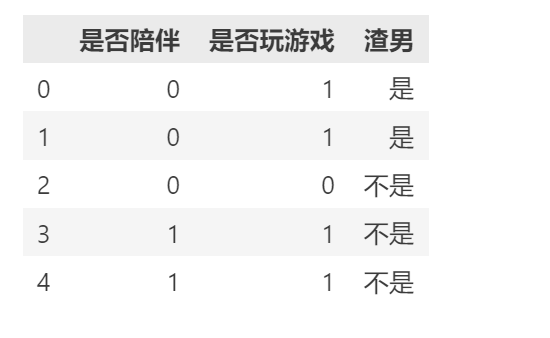

```python
# 1.实现信息熵计算函数
def calEntropy(dataset):
  '''
  cal Entropy values
  '''
  
  # 先获取样本的总数
  n_samples = dataset.shape[0]
  
  #获取标签的所有类别
  classes = dataset.iloc[:, -1].value_counts()
  
  # 计算每一类标签占据样本总数的百分比
  px_i = classes / n_samples
  
  return (-px_i * np.log2(px_i)).sum() # 计算所得的信息熵

def text():
  print('当前输入数据的信息熵为{}'.format(calEntropy(dataset)))
  
text()
```


```python
# 2.定义最优列选择函数，输入经过信息增益计算后的最优列的索引值（第几个特征是本次的最优划分特征）
def selectBestSplit(dataset):
  '''
  最优划分特征的选择
  '''
  # 先计算原始的信息熵（父节点信息熵）
  base_entropy = calEntropy(dataset)
  
  # 初始化一个变量，用于保存计算后所得的信息增益值
  baseGain = 0
  
  # 初始化一个变量，用于保存挑选出的最优划分特征的列索引的值，因为列索引的值都是从0开始的，所以改变了的初值置为-1
  axis = -1
  
  #遍历所有特征
  for i in range(dataset.shape[1] - 1):
    
    #提取出当前特征的所有取值
    levels = dataset.iloc[:, i].value_counts().index
    
    # 初始化一个变量，用于保存子节点的信息熵计算结果
    ents = 0
    
    # 加一个计数，只是为了最终的结果输出
    m = 0
    
    # 对当前特征列的每一个所取到的值遍历 —— 表示可以依据当前特征将数据集划分为多少个子集
    for j in levels:
      m += 1
      
      # 获取划分到当前子节点的所有样本所构成的dataframe
      chile_dataset = dataset[dataset.iloc[:, i] == j] # boolean索引 —— 在dataset中，找出这样的样本，样本中第i特征列取到j这个值的索引样本
      
      # 计算当前子节点的信息熵
      ent = calEntropy(chile_dataset)
      
      # 计算权重
      ents += (chile_dataset.shape[0] / dataset.shape[0]) * ent
      
    print('依据当前第{}个特征对数据集dataset进行划分，此时得到了{}个划分后的子节点，当前特征划分后所有子节点的总信息熵为:{}'.format(i + 1, m, ents))
    
    # 计算采用当前第i个特征划分后所得的当前特征列划分下的信息增益
    infoGain = base_entropy - ents
    
    print('第{}个特征列划分后所得的信息增益为:{}'.format(i + 1, infoGain))
    
    # 判断如果当前特征列划分后所得的信息增益大于前一个特征列划分后所记录下来信息增益，就说明采用当前特征列做划分是更好的
    if infoGain > baseGain:
      
      # 将当前特征列的信息增益值更新到全局（baseGain）
      baseGain = infoGain
      
      axis = i

  print('经过最优划分特征的选取和计算，当前数据集中，本次划分可以采用的最优划分特征为:{}'.format(dataset.columns[axis]))

  return axis

def test():
  selectBestSplit(dataset)
  
test()
```

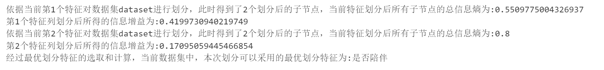

```python
# 3.按照选出的最优划分特征对当前数据集开始进行划分
def getSplitData(dataset, axis, value):
  '''
  按照给定选出的最优划分特征切分当前数据集
  :params dataset:指定需要切分的数据集
  :params axis:选出的最优划分特征列索引的值
  :params value:指定最优划分特征列中的哪一个属性值进行划分
  '''
  
  # 按照已获得的最优划分特征列索引值获取该列的所有取值
  best_col_name = dataset.columns[axis]
  
  # 对应best_col中指定的value这个值，将该值的所有行全部过滤出来，并删除最优化发特征列，即得切分后的数据集
  return dataset.loc[dataset[best_col_name] == value, :].drop(best_col_name, axis = 1) # boolean索引

getSplitData(dataset, selectBestSplit(dataset), 1)
# getSplitData(dataset, selectBestSplit(dataset), 0)
```

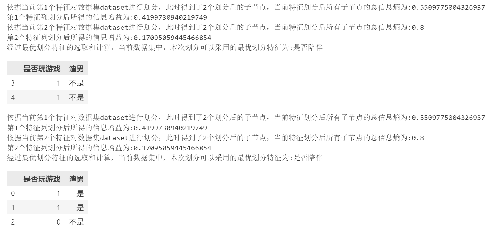

```python
dataset.iloc[:, -1].value_counts()
```

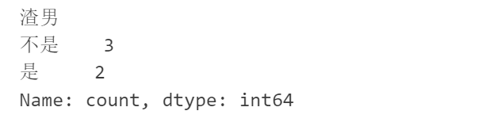

### Decision Tree Model - ID3 Algorithm

```python
# 4.原生python代码实现基于最大信息增益划分数据集并递归建造决策树模型的ID3算法模型复现
def createID3Tree(dataset):  
  '''
    :params dataset:指定的数据集
    :return:以字典结构构建的最终ID3算法决策树模型
  '''
  
  # 先取出数据集中所有特征列 —— 取出的是所有特征的列索引名称
  feature_list = list(dataset.columns)
  
  # 获取数据集中最后一列的列索引名称 —— 即标签 —— 然后再获取标签的所有类别及各类别的样本数量
  classes = dataset.iloc[:, -1].value_counts()
  
  # 判断：当前数据集中标签的各个类别中的各个类别及各类别的样本数量中，样本数量最大的类别的样本数量是否直接等于样本容量的大小 ——   即：表示当前样本中是否所有样本同属同一类别
  # 或者：当前数据集是否只有一个特征列
  if classes[0] == dataset.shape[0] or dataset.shape[1] == 1:
    return classes.index[0]
  
  # 开始真正的ID3算法递归构建决策树的过程
  
  # 先选出最优划分特征列
  axis = selectBestSplit(dataset)
  
  # 根据选出的最优划分特征的列索引，获取该列索引对应的该列特征
  best_features = feature_list[axis]

  # 准备一个字典，用字典结构存储决策树的信息
  ID3_Tree = {
    best_features : {}
  }
  
  # 将当前选出的最优划分特征列从数据集中删除
  del feature_list[axis]
  
  # 获取最优划分特征列的所有取值
  value_list = list(set(dataset.iloc[:, axis])) # set是python中的集合类型，自带去重特性 
  
  # for循环遍历当前选定的最优划分特征列的每一个取值
  for value in value_list:
    
    # 开始递归建造ID3决策树
    ID3_Tree[best_features][value] = createID3Tree(getSplitData(dataset, axis, value))
    
  return ID3_Tree

final_ID3Tree = createID3Tree(dataset)

final_ID3Tree
  
'''
{
  '是否陪伴':{
    0:{
      '是否玩游戏':{
        0: '不是',
        1: '是'
      }
    }, 
    1: '不是'
  }
}
'''    
```

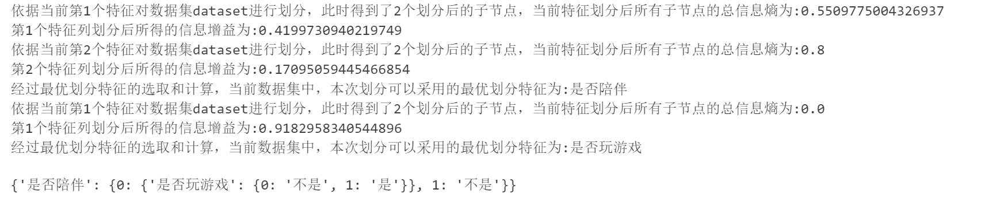

### Decision Tree Model - C4.5 Algorithm

In the C4.5 model, feature selection is changed to using the information gain rate criterion

### Decision Tree Model - CART Algorithm

#### Pruning Decision Tree 

The process of removing some leaf nodes in the decision tree

Common pruning strategies include $\textcolor{orange}{Pre-Pruning}$ and $\textcolor{orange}{Post-Pruning}$​

Differentiation between Pre-Pruning and Post-Pruning：

| main points        |                         Pre-Pruning                          | Post-Pruning                                                 |
| ------------------ | :----------------------------------------------------------: | ------------------------------------------------------------ |
| Number of branches |             Many branches have not been expanded             | Retained more branches                                       |
| Fit risk           | Reduced the risk of overfitting, but due to the nature of greedy algorithms, it prohibits the expansion of subsequent branches and brings the risk of underfitting | Create a decision tree first and then examine it one by one from bottom to top, ensuring the prevention of overfitting while reducing the risk of underfitting, resulting in stronger generalization ability |
| Time cost          |                Low training and testing costs                | Training expenses are too high                               |

We mainly discuss the implementation process of $\textcolor{orange}{Cost\ Complexity\ Pruning.\ CCP}$​(代价复杂度剪枝) —— A pruning algorithm implemented by minimizing the overall loss function of the decision tree

If there is a fully growing decision tree T with $|T|$ leaf nodes and N sample space, t is the leaf node of decision tree T, and there are $N_t$ sample points on this leaf node, among which there are $N_t^k$ (k = 1, 2, ..., k)sample points belonging to the k-th class, then the overall loss function of the decision tree can be defined as(设有一棵完全生长的决策树$\textcolor{orange}{T}$，其叶子节点的个数为$\textcolor{orange}{|T|}$ ，样本空间为$\textcolor{orange}{N}$，$\textcolor{orange}{t}$为决策树$\textcolor{orange}{T}$的叶子节点，且该叶子节点上有$\textcolor{orange}{N_t}$个样本点，其中属于属于第$\textcolor{orange}{k}$类的样本点有$\textcolor{orange}{N_t^k, (k = 1, 2, ..., k)}$​个，则决策树的整体损失函数可以定义为：) :

$$
C_α(T) = C(T) + α|T|
$$

Where $\textcolor{orange}{C(T)}$ represents the prediction error of the model on the training data :

$$
Cα(T) = \sum_{t = 1}^{|T|}\frac{N_t}{N}H_t(T)+α|T|
$$

Where $\textcolor{orange}{H_t(T)}$ represents the information entropy or Gini coefficient of the leaf node $\textcolor{orange}{t}$​

$$
H_t(T) = -\sum_{k = 1}^{k}\frac{N_t^k}{N_t}\log_2\frac{N_t^k}{N_t}\\
or\\
H_t(T) = 1 - \sum_{k = 1}^{k}(\frac{N_t^k}{N_t})^2
$$

The formula for $\textcolor{orange}{Gini\ Coefficient}$ is as follows

$$
Gini(D) = 1 - \sum_{k = 1}^{k}(\frac{|C_k|}{D})^2
\\
Gini(D|A) = \frac{D_1}{D}Gini(D_1) + \frac{|D_2|}{D}Gini(D_2)
$$

$\textcolor{orange}{|D|}$ represents the number of samples in dataset $\textcolor{orange}{D}$,  $\textcolor{orange}{D_1}$ and $\textcolor{orange}{D_2}$ represent the number of samples in subsets

## DEMO07_DECISION_TREE_CLASSIFIER_FOR_SKLEARN_DATA

```python
# 导包
import numpy as np
import pandas as pd
import matplotlib.pyplot as plt

# 导入CART分类树模型对象
from sklearn.tree import DecisionTreeClassifier, export_graphviz

# 导入红酒数据集
from sklearn.datasets import load_wine

# 导入数据集划分对象
from sklearn.model_selection import train_test_split

# 导入分类模型的评估指标accuracy_score
from sklearn.metrics import accuracy_score

# 导入graphviz工具依赖项
import graphviz

from IPython.core.interactiveshell import InteractiveShell # 这个对象设置所有行全部输出
  
# 设置该对象ast_node_interactivity的属性值为all，表示notebook下每一行有输出的代码全部输出运算结果
InteractiveShell.ast_node_interactivity = "all"

# 解决坐标轴刻度负号乱码
plt.rcParams['axes.unicode_minus'] = False

# 解决中文乱码问题
plt.rcParams['font.sans-serif'] = ['Simhei']
plt.style.use('ggplot')
```

```python
# 加载数据
dataset = load_wine()
x = dataset.data
y = dataset.target

pd.DataFrame(x, columns = dataset.feature_names)

pd.DataFrame(y).value_counts()

x.shape
```

```python
# 划分数据集
Xtrain, Xtest, Ytrain, Ytest = train_test_split(x, y, test_size=0.3, random_state=123)
```

```python
# 构建CART分类器模型对象
clf = DecisionTreeClassifier(
  criterion = 'gini',
  random_state = 123,
  # splitter = 'beat'
  max_depth = 2,
  min_samples_leaf = 2,
  min_samples_split = 10
  
)

# 完成模型训练
clf = clf.fit(Xtrain, Ytrain)

# 测试集预测结果
y_pred = clf.predict(Xtest)

# 使用accuracy_score评估预测的准确率
accuracy_score(y_pred, Ytest)
```

```python
# 可视化当前决策树模型
dot_data = export_graphviz(
  clf,
  out_file=None,
  feature_names=dataset.feature_names,
  class_names=[str(i[0]) for i in list(pd.DataFrame(y).value_counts().index)],
  filled = True,
  rounded = True
)

# 可视化呈现
graph = graphviz.Source(dot_data)
graph
```

```python
# 决策树对象相关的重要属性

# 1.显示各个特征的重要性
# clf.feature_importances_
[*zip(dataset.feature_names, clf.feature_importances_)]
```

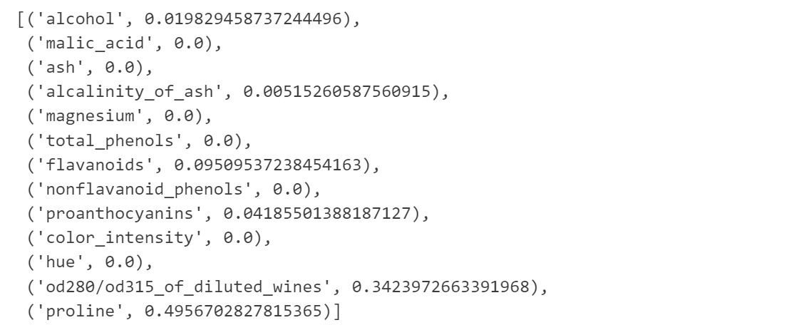

```python
# 返回经过决策树模型的训练，每一个训练样本决策树将其分到了哪一个叶子节点
clf.apply(Xtrain)
```

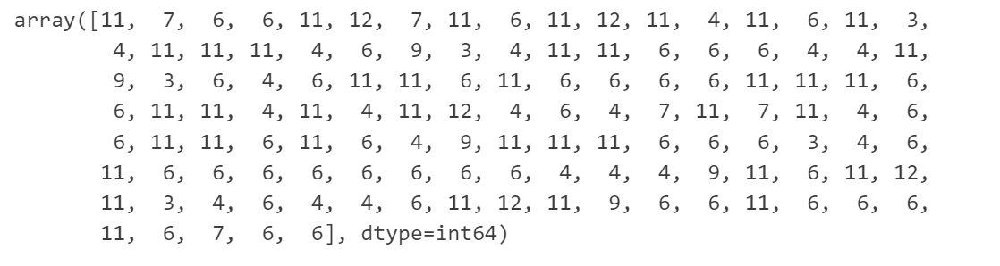

```python
# 返回树节点的个数
clf.tree_.node_count
```

```python
# 返回每个节点对应的特征索引值
clf.tree_.feature
```

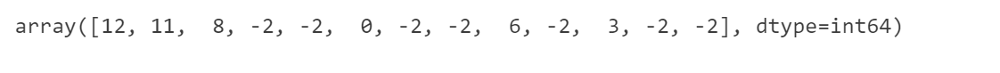

```python
# 查看当前决策树模型在训练集上的表现如何
clf.score(Xtrain, Ytrain)
clf.score(Xtest, Ytest)
```

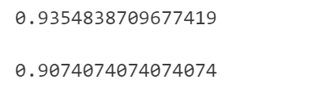

```python
# 以max_depth为例，对该剪枝超参数进行调优，确定该参数的最优取值
# 准备一个scores数组，准备保存评分数组
scores = []

for i in range(3, 10):
  
  # 构建分类树模型
  clf = DecisionTreeClassifier(
    criterion = 'gini',
    max_depth = i
  )
  
  # 训练模型
  clf = clf.fit(Xtrain, Ytrain)
  
  # 评估模型预测准确率
  scores.append(clf.score(Xtest, Ytest))
  
plt.plot(range(3, 10), scores, color = 'red', label = '学习曲线')

print('经过上述超参数学习曲线对剪枝超参数max_depth的调优，结论：当max_depth参数取值为{}时，模型对应获得了最高的准确率：{}'.format(scores.index(max(scores)) +3, max(scores)))
```

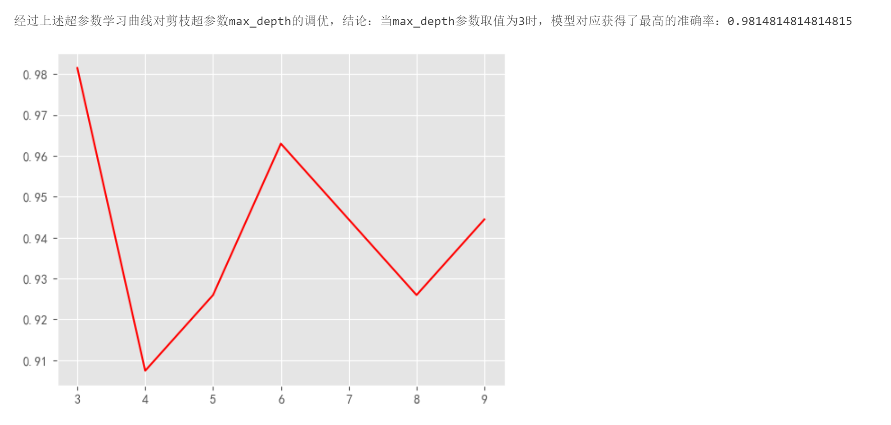

```python
# 构建分类树模型
clf = DecisionTreeClassifier(
  criterion = 'gini',
  max_depth = 2,
  ccp_alpha = 0.01572
)
  
# 训练模型
clf = clf.fit(Xtrain, Ytrain)
  
# 评估模型预测准确率
accuracy_score(y_pred, Ytest)
```

```python
# CCP路径计算API
ccp_path = clf.cost_complexity_pruning_path(Xtrain, Ytrain)
print('ccp_alphas:{}'.format(ccp_path.ccp_alphas))
print('impurities:{}'.format(ccp_path.impurities))
```

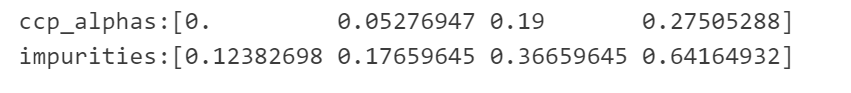

```python
# 可视化当前决策树模型
dot_data = export_graphviz(
  clf,
  out_file=None,
  feature_names=dataset.feature_names,
  class_names=[str(i[0]) for i in list(pd.DataFrame(y).value_counts().index)],
  filled = True,
  rounded = True
)

# 可视化呈现
graph = graphviz.Source(dot_data)
graph
```

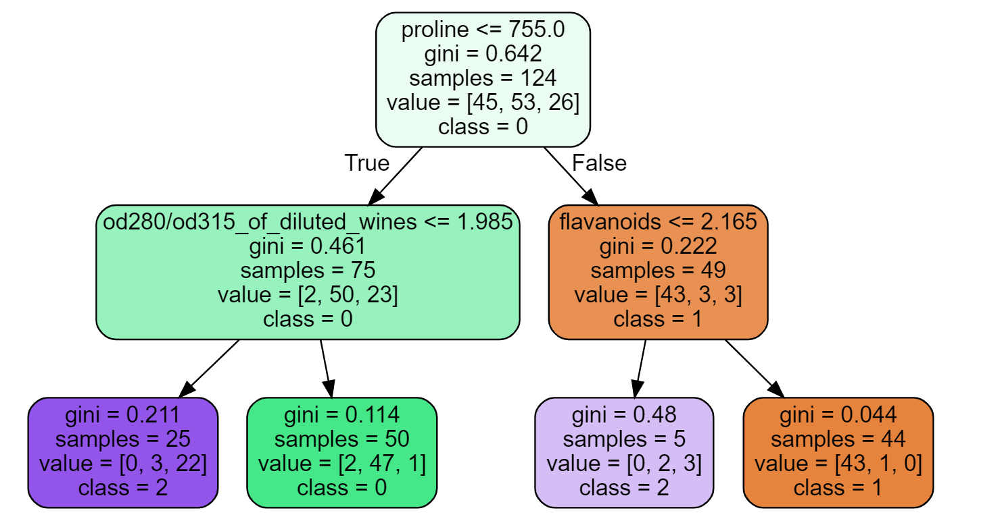