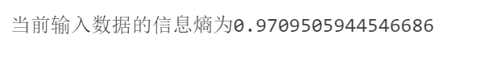

# Decision Tree Model: Supervised Learning Classification Algorithm

$\textcolor{orange} {Entropy}$ —— represents the degree of confusion and uncertainty of an object

Entropy function expression :

$$
Entorpy = -\sum_{i = 1}^{n} p(x_i)\log_2p(x_i)
$$

When type A and type B each account for 50% probability : 

$$
Entorpy = -[\frac{1}{2}\log_2(\frac{1}{2}) + \frac{1}{2}\log_2(\frac{1}{2})]= -(-\frac{1}{2} - \frac{1}{2}) = 1
$$

When there is only type A or type B :

$$
Entorpy = -[1 * \log_21 + 0] = -(0 + 0) = 0
$$

When the entropy is maximum 1, it is the state with the worst classification effect. On the contrary, when it is minimum 0, it is the state of complete classification.

$\textcolor{orange}{Information\ Gain}$ —— The measurement method of describing the division effect of test conditions is the difference between the information entropy of the parent node and the weighted average of the information entropy of each leaf node.

$$
Gain(D, a) = Ent(D) - \sum_{i = 1}^{v}\frac{|D_v|}{|D|}Ent(D_v)
$$

$Ent(D)$ is the impurity of the parent node,  $\sum_{i = 1}^{v}\frac{|D_v|}{|D|}Ent(D_v)$​ is the weighted average of the impurity of each branch node under the support of each weight

$\textcolor{orange}{Information\ Gain\ Rate}$ :

$$
Gain_{ratio}(D, A) = \frac{Gain(D, A)}{IV(A)}
$$

$$
IV(A) = - \sum_{i = 1}^{v}\frac{|D_v|}{|D|}\log_2\frac{|D_v|}{|D|}
$$

IV(A) is called intrinsic value, actually is the purity of attribute A

## DEMO06_DECISION_TREE_SIMPLE_FOR_PYTHON

```python
# 导包
import numpy as np
import pandas as pd
import matplotlib.pyplot as plt

from IPython.core.interactiveshell import InteractiveShell # 这个对象设置所有行全部输出
  
# 设置该对象ast_node_interactivity的属性值为all，表示notebook下每一行有输出的代码全部输出运算结果
InteractiveShell.ast_node_interactivity = "all"

# 解决坐标轴刻度负号乱码
plt.rcParams['axes.unicode_minus'] = False

# 解决中文乱码问题
plt.rcParams['font.sans-serif'] = ['Simhei']
plt.style.use('ggplot')
```

```python
# 数据准备
row_data = {
  '是否陪伴' : [0, 0, 0, 1, 1],
   '是否玩游戏' : [1, 1, 0, 1, 1],
   '渣男' : ['是', '是', '不是', '不是', '不是']
}

# 构建为dataframe
dataset = pd.DataFrame(row_data)
dataset
```


```python
# 1.实现信息熵计算函数
def calEntropy(dataset):
  '''
  cal Entropy values
  '''
  
  # 先获取样本的总数
  n_samples = dataset.shape[0]
  
  #获取标签的所有类别
  classes = dataset.iloc[:, -1].value_counts()
  
  # 计算每一类标签占据样本总数的百分比
  px_i = classes / n_samples
  
  return (-px_i * np.log2(px_i)).sum() # 计算所得的信息熵

def text():
  print('当前输入数据的信息熵为{}'.format(calEntropy(dataset)))
  
text()
```



```python
# 2.定义最优列选择函数，输入经过信息增益计算后的最优列的索引值（第几个特征是本次的最优划分特征）
def selectBestSplit(dataset):
  '''
  最优划分特征的选择
  '''
  # 先计算原始的信息熵（父节点信息熵）
  base_entropy = calEntropy(dataset)
  
  # 初始化一个变量，用于保存计算后所得的信息增益值
  baseGain = 0
  
  # 初始化一个变量，用于保存挑选出的最优划分特征的列索引的值，因为列索引的值都是从0开始的，所以改变了的初值置为-1
  axis = -1
  
  #遍历所有特征
  for i in range(dataset.shape[1] - 1):
    
    #提取出当前特征的所有取值
    levels = dataset.iloc[:, i].value_counts().index
    
    # 初始化一个变量，用于保存子节点的信息熵计算结果
    ents = 0
    
    # 加一个计数，只是为了最终的结果输出
    m = 0
    
    # 对当前特征列的每一个所取到的值遍历 —— 表示可以依据当前特征将数据集划分为多少个子集
    for j in levels:
      m += 1
      
      # 获取划分到当前子节点的所有样本所构成的dataframe
      chile_dataset = dataset[dataset.iloc[:, i] == j] # boolean索引 —— 在dataset中，找出这样的样本，样本中第i特征列取到j这个值的索引样本
      
      # 计算当前子节点的信息熵
      ent = calEntropy(chile_dataset)
      
      # 计算权重
      ents += (chile_dataset.shape[0] / dataset.shape[0]) * ent
      
    print('依据当前第{}个特征对数据集dataset进行划分，此时得到了{}个划分后的子节点，当前特征划分后所有子节点的总信息熵为:{}'.format(i + 1, m, ents))
    
    # 计算采用当前第i个特征划分后所得的当前特征列划分下的信息增益
    infoGain = base_entropy - ents
    
    print('第{}个特征列划分后所得的信息增益为:{}'.format(i + 1, infoGain))
    
    # 判断如果当前特征列划分后所得的信息增益大于前一个特征列划分后所记录下来信息增益，就说明采用当前特征列做划分是更好的
    if infoGain > baseGain:
      
      # 将当前特征列的信息增益值更新到全局（baseGain）
      baseGain = infoGain
      
      axis = i

  print('经过最优划分特征的选取和计算，当前数据集中，本次划分可以采用的最优划分特征为:{}'.format(dataset.columns[axis]))

  return axis

def test():
  selectBestSplit(dataset)
  
test()
```


```python
# 3.按照选出的最优划分特征对当前数据集开始进行划分
def getSplitData(dataset, axis, value):
  '''
  按照给定选出的最优划分特征切分当前数据集
  :params dataset:指定需要切分的数据集
  :params axis:选出的最优划分特征列索引的值
  :params value:指定最优划分特征列中的哪一个属性值进行划分
  '''
  
  # 按照已获得的最优划分特征列索引值获取该列的所有取值
  best_col_name = dataset.columns[axis]
  
  # 对应best_col中指定的value这个值，将该值的所有行全部过滤出来，并删除最优化发特征列，即得切分后的数据集
  return dataset.loc[dataset[best_col_name] == value, :].drop(best_col_name, axis = 1) # boolean索引

getSplitData(dataset, selectBestSplit(dataset), 1)
# getSplitData(dataset, selectBestSplit(dataset), 0)
```

