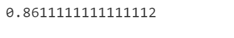
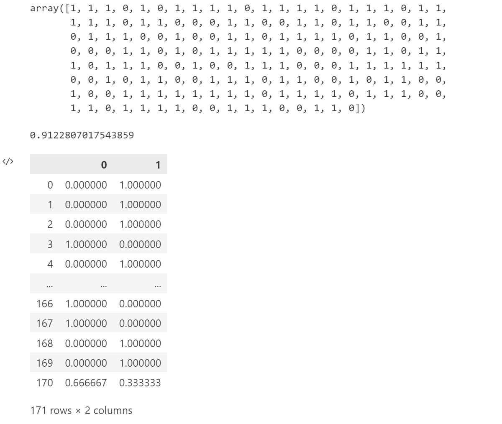
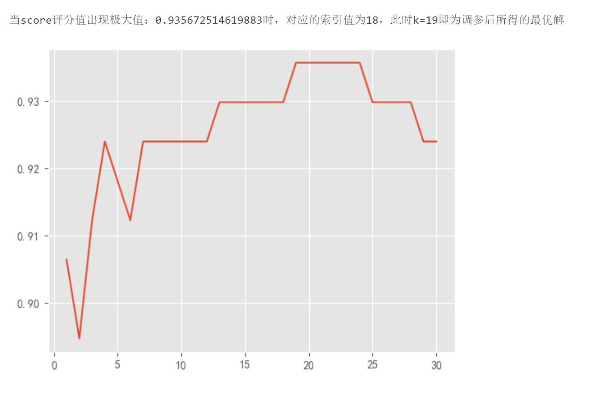
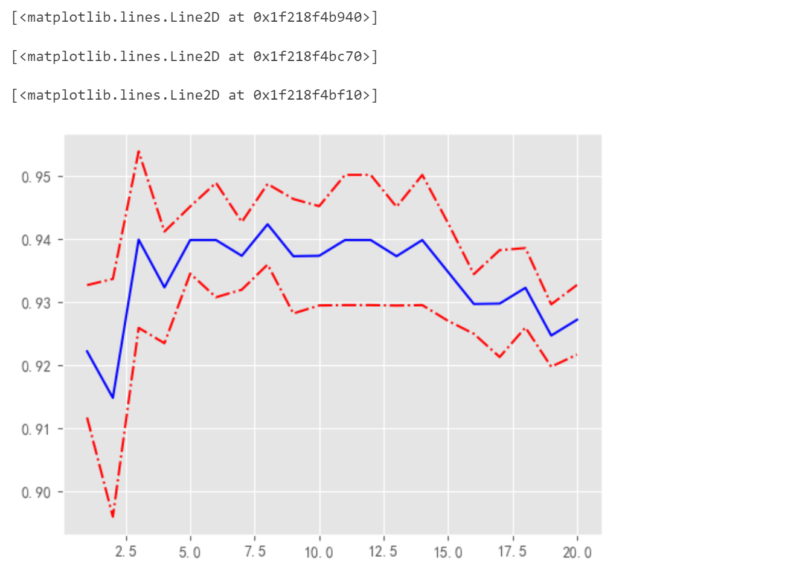
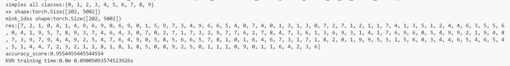

# KNN最邻近算法	

## 1.DEMO01_PYTHON_FOR_KNN

```python
'''
Author: Szl
Date: 2024-03-19 10:07:52
LastEditors: Szl
LastEditTime: 2024-03-19 11:33:51
Description:  
'''

# imort statements
import numpy as np
import pandas as pd
import matplotlib.pyplot as plt

# 解决坐标轴刻度负号乱码
plt.rcParams['axes.unicode_minus'] = False

# 解决中文乱码问题
plt.rcParams['font.sans-serif'] = ['Simhei']
plt.style.use('ggplot')

# 1.create fake data
row_data = {
    '颜色深度' : [14.13, 13.2, 13.16, 14.27, 13.24, 12.07, 12.43, 11.79, 12.37, 12.04],
    '酒精浓度' : [5.64, 4.28, 5.68, 4.80, 4.22, 2.76, 3.94, 3.10, 2.12, 2.6],
    '品种' : [0, 0, 0, 0, 0, 1, 1, 1, 1, 1]  # 0代表“黑皮诺” 1代表“赤霞珠” labels
}

# create dataframe
wine_data = pd.DataFrame(
  data = row_data
)

print(wine_data)

# 2.拆分数据集，从中划分出特征和标签
x = np.array(wine_data.iloc[:, 0 : 2]) # 所有行全要，只要第一第二列
y = np.array(wine_data.iloc[:, -1]) # 所有行全要，只要最后一列


# create scatter
# 将labels = 1的品种的红酒，将其颜色深度作为散点图的x坐标值，酒精浓度作为散点图的y坐标值
# 将labels = 0的品种的红酒，将其颜色深度作为散点图的x坐标值，酒精浓度作为散点图的y坐标值
# 同时在准备一个测试数据，即给出一杯位置分类的红酒的特征值
# 观察散点图中各个样本点与未知测试数据的位置关系

new_data = np.array([12.03, 4.1]) # 未知分类的待标记样本

plt.scatter(
    x[y == 1, 0],
    x[y == 1, 1],
    color = 'red',
    label = '赤霞珠'
) # 画出标签y为1的，关于类别1：赤霞珠红酒的散点图

plt.scatter(
    x[y == 0, 0],
    x[y == 0, 1],
    color = 'black',
    label = '黑皮诺'
    
) # 画出标签y为0的，关于类别0：黑皮诺红酒的散点图

plt.scatter(
  new_data[0],
  new_data[1],
  color = 'yellow',
  label = '带标记测试样本'
)

# 设置散点图相关属性
plt.xlabel('酒精浓度')
plt.ylabel('颜色深度')
plt.legend(loc = 'lower right')
# 保存散点图
# plt.savefig('./wine_lable.png')

# 计算所有的已知类别类别的样本和待标记样本间的距离
# 使用欧氏距离计算公式 - 欧式距离如何实现：自己写
# 给出欧式距离计算公式，随后计算出所有样本点与待标记样本点之间的距离，获得距离数组
distance = [np.sqrt(np.sum((x_num - new_data) ** 2)) for x_num in x]
print(distance)

# 升序排序 - 距离最近的索引值
sort_list = np.argsort(distance)
print(sort_list)

# 假设此时指定k值为3，寻找前三个样本为new_data的最近的三个邻居
k = 3
# 从sort_list中找出前k个邻居样本
top_k = [y[i] for i in sort_list[0 : k]] # 获取前k个邻居样本各自所属的标签类别
print(top_k)

# 将top_k构造为series对象
print(pd.Series(top_k).value_counts()) # value_counts方法默认在展示样本所有各个类别的数量的同时，还会按照数量大小实现降序排列进行展示

class_map = {1 : '赤霞珠', 0 : '黑皮诺'}

print('带标记的测试样本：{}经由KNN最近邻算法，得出其所属的类别为：{}'.format(new_data, class_map[int(pd.Series(top_k).value_counts().index[0])]))


if __name__ == '__main__':
    pass
```

## 2.DEMO02_SCIKIT-LEARN_FOR_KNN_DATASET_WINE

```python
# 导包
import numpy as np
import pandas as pd
import matplotlib.pyplot as plt

from IPython.core.interactiveshell import InteractiveShell # 这个对象设置所有行全部输出

# 设置该对象ast_node_interactivity的属性值为all，表示notebook下每一行有输出的代码全部输出运算结果
InteractiveShell.ast_node_interactivity = "all"

# 解决坐标轴刻度负号乱码
plt.rcParams['axes.unicode_minus'] = False

# 解决中文乱码问题
plt.rcParams['font.sans-serif'] = ['Simhei']
plt.style.use('ggplot')


```

```python
# 加载数据
from sklearn.datasets import load_wine

# 获取数据
wine_data = load_wine()


# sklearn自带数据集的方法调用后不会直接返回dataset，而是先返回一个名为sklearn.utils._bunch.Bunch类型的类字典对象
# 在这个对象中，可以使用类似与字典的按键取值的方式来获取需要的数据集

data = pd.DataFrame(
  data = wine_data.data,
  columns = wine_data.feature_names
)

# 获取标签,标签列转化为Series对象
target = pd.Series(wine_data.target)

# 拼接
data = pd.concat([data, target], axis = 1)

# 修改标签列的列名
feature_names = list(wine_data.feature_names)
feature_names.append('target')
feature_names = np.array(feature_names)

data.columns = feature_names

data

```

```python
# 准备数据
x = wine_data.data
y = wine_data.target

# 导入KNN分类器模型对象
from sklearn.neighbors import KNeighborsClassifier

# 完成数据集划分
from sklearn.model_selection import train_test_split # sklearn提供的数据集划分对象，可以从原始数据集中按照比例划分出训练集和数据集
Xtrain, Xtest, Ytrain, Ytest = train_test_split(x, y, test_size = 0.2, random_state = 56) # 使用该API划分得出：训练集数据及标签，测试集数据及标签


# 构建KNN分类器模型
clf = KNeighborsClassifier(n_neighbors = 3)

# 模型训练
clf = clf.fit(Xtrain, Ytrain)

# 模型推理
y_pred = clf.predict(Xtest)

# 模型评估
clf.score(Xtest, Ytest)
```



## DEMO03_SCIKIT-LEARN_FOR_KNN_DATASET_BREAST_CANCER

```python
# 导包
import numpy as np
import pandas as pd
import matplotlib.pyplot as plt

from IPython.core.interactiveshell import InteractiveShell # 这个对象设置所有行全部输出
  
# 导入威斯康辛州女性乳腺癌患病检测数据集
from sklearn.datasets import load_breast_cancer

# 导入数据集划分工具
from sklearn.model_selection import train_test_split

# 导入KNN分类器对象
from sklearn.neighbors import KNeighborsClassifier

# 设置该对象ast_node_interactivity的属性值为all，表示notebook下每一行有输出的代码全部输出运算结果
InteractiveShell.ast_node_interactivity = "all"

# 解决坐标轴刻度负号乱码
plt.rcParams['axes.unicode_minus'] = False

# 解决中文乱码问题
plt.rcParams['font.sans-serif'] = ['Simhei']
plt.style.use('ggplot')
```

```python
# 1.加载数据
cancer_data = load_breast_cancer()

x = cancer_data.data
y = cancer_data.target
```

```python
# 2.进行简单的数据探索

# x.shape

name = [
  '平均半径', '平均纹理', '平均周长', '平均面积', '平均光滑度', '平均紧凑度',
  '平均凹度', '平均凹点', '平均对称', '平均分形维数', '半径误差', '纹理误差', '周长误差', '面积误差', '平滑度误差', '紧凑度误差', '凹度误差', '凹点误差', '对称误差', '分形维数误差', '最差半径', '最差纹理', '最差边界', '最差区域', '最差平滑度', '最差紧凑型', '最差凹陷', '最差凹点', '最差对称性', '最差分形维数', '患病否'
]

data = pd.DataFrame(data = x)
targets = pd.DataFrame(data = y, columns = ['target'])
targets.value_counts()
data = pd.concat([data, targets], axis = 1)
data.columns = name
data
```

```python
# 3.完成数据集的划分
X_train, X_test, Y_train, Y_test = train_test_split(x, y, test_size = 0.3, random_state = 2)

# 4.构建KNN模型
clf = KNeighborsClassifier(n_neighbors = 19)

# 5.训练模型
clf = clf.fit(X_train, Y_train) # 传入训练集数据和标签

# 6.获取测试集预测结果
y_pred = clf.predict(X_test) # 传入测试集数据
y_pred

# 7.评估模型在测试集上的表现，获取其评分
score = clf.score(X_test, Y_test) # 传入测试集数据和标签
score

# 8.查看二分类的概率分布
pred = pd.DataFrame(clf.predict_proba(X_test)) # 传入测试集数据
pred
```



### Hyperparameter K & Learning curve & Select the optimal K value

```python
# 超参数学习曲线

# 准备预测结果保存序列，每更换一次k值，获取一次预测结果，该结果以及对应折线图的纵坐标
scores = []

# 给定k值的变化范围
k_range = range(1, 31)

# 构建for循环
for i in k_range:
  
  # 每一次迭代过程中都构建一次KNN分类器对象
  clf = KNeighborsClassifier(n_neighbors = i)
  
  # 训练模型
  clf = clf.fit(X_train, Y_train)
  
  # 评估模型，获得评估分数，将其添加到scores序列
  scores.append(clf.score(X_test, Y_test))

plt.plot(k_range, scores)
# scores.index(max(scores))

print('当score评分值出现极大值：{}时，对应的索引值为{}，此时k={}即为调参后所得的最优解'.format(
  max(scores),
  scores.index(max(scores)), 
  scores.index(max(scores)) + 1)
)
```



### Cross validation( K-Folder Cross Validation))

$$
E = \frac{1}{n}\sum_{i = 1}^{n} E_i
$$

```python
# 绘制带有K折交叉验证的超参数学习曲线对超参数K进行调优，求解出其局部最优解
from sklearn.model_selection import cross_val_score

# 评分结果的保存序列
scores = []

# 准备保存K折交叉验证时所得预测结果的方差数组
var = []

# 准备K值的变化范围
k_range = range(1, 21)

# for循环遍历
for i in k_range:
  
  # 构建KNN分类器模型
  clf = KNeighborsClassifier(n_neighbors = i)
  
  # 交叉验证
  cv = cross_val_score(clf, X_train, Y_train, cv = 10) # 传入一个基本模型，传入训练集数据和标签，cv交叉验证会自动完成10折交叉验证过程，这个过程会自动进行10次模型在不同训练集和测试集上的训练及预测过程
  
  # 获取每一次交叉验证所得的预测评分，求均值后加入到scores中
  scores.append(cv.mean())
  
  # 获取每一次交叉验证所得的预测评分，求评分的方差后加入到var中
  var.append(cv.var())
  
plt.plot(k_range, scores, color = 'blue') # 这是绘制的第一条曲线，表示10折交叉验证的均值评分结果

# 绘制带有正负方差效果的均值曲线
plt.plot(k_range, np.array(scores) + np.array(var) * 10, color = 'red', linestyle = '-.')
plt.plot(k_range, np.array(scores) - np.array(var) * 10, color = 'red', linestyle = '-.')
```



## DEMO04_PYTORCH_FOR_KNN_DATASET_MNIST

```python
'''
Author: Szl
Date: 2024-03-20 11:24:53
LastEditors: Szl
LastEditTime: 2024-03-20 16:09:03
Description: 
'''


# -----------------------
# Package and Modules import statements
# -----------------------

# fromtorchvision import datasets of MNIST and transforms
from torchvision import datasets, transforms

# import base medules
import numpy as np

# import evluation metrics of accuracy_score
from sklearn.metrics import accuracy_score

import torch

from time import time, sleep

# -----------------------
# codings
# -----------------------

# download and load MNIST and dataset split for data and target
def load_and_split_dataset():
  # 1.download and load train dataset
  train_dataset = datasets.MNIST(
    root = './data', # Path
    download = True, # True:need to download
    transform = transforms.ToTensor(), # need change data type from ndarray to tensor 
    train = True # this is a train dataset
  )
  
  # 2.download and load test dataset
  test_dataset = datasets.MNIST(
    root = './data', # Path
    download = True, # True:need to download
    transform = transforms.ToTensor(), # need change data type from ndarray to tensor 
    train = False # this is a test dataset
  )

  # 2.split data and target from train dataset and test dataset
  train_x = [] # train data
  train_y = [] # train target
  
  # iter for each sample
  for i in range(len(train_dataset)): # i is index(row)
    
    # get sample and target
    images, target = test_dataset[i]

    # every sample append to list
    train_x.append(images.view(-1)) # images.view(-1) means reshape tensor
    train_y.append(target)
    
    # MNIST dataset 55000 train samples, we only need 5000 samples
    if i > 5000:
      break
  
  test_x = [] # test data
  test_y = [] # test target
  
  # iter for each sample
  for i in range(len(test_dataset)): # i is index(row)
    
    # get sample and target
    images, target = test_dataset[i]

    # every sample append to list
    test_x.append(images.view(-1)) # images.view(-1) means reshape tensor
    test_y.append(target)
    
    # MNIST dataset 10000 train samples, we only need 200 samples
    if i > 200:
      break

  print('simples all classes:{}'.format(set(train_y))) 
  return train_x, train_y, test_x, test_y

# define KNN model
def KNN_model(train_x, train_y, test_x, test_y, k):
  '''
  	 train_y - train target
     test_x - test dataset
     tesr_y - test target  
  '''
  
  # set local timestamp
  since = time()
  
  # get train dataset and test dataset of samples
  m = test_x.size(0) # == test_x.shape[0]
  n = train_x.size(0)
  
  # test dataset and train dataset original dimension(维度) is m * 1, ** 2 is square(平方) for each samples
  # sum(dim = 1 mean sum for line(samples),keepdim = True mean keep 2 dimension).expand(m, n) mean change the dimension for keep m * n
  xx = (test_x ** 2).sum(dim = 1, keepdim = True).expand(m, n) # a mapping test sample, b mapping train sample
  yy = (train_x ** 2).sum(dim = 1, keepdim = True).expand(n, m).transpose(0, 1) # mean reshape(转置)
  # xx and yy : a ^ 2 and b ^ 2
  print('xx shape:{}'.format(xx.size()))
  print('yy shape:{}'.format(yy.size()))
  
  # calculator(计算) number of k samples nearest neighor distance
  distance_matrix = xx + yy - 2 * test_x.matmul(train_x.transpose(0, 1)) # 矩阵乘法的API，因为test_x不是一个单独的标量值，是一个矩阵（数组）
  print('distance_matrix shape:{}'.format(distance_matrix.size()))
  
  # sort for distance_matrix, find which sample is the nearest neighbor 
  mink_idxs = distance_matrix.argsort(dim = -1) # index
  print('mink_idxs shape:{}'.format(mink_idxs.size()))
  
  # empty list to save k nums nearest neighbor
  res = [] # 承载的职责是：找到k个最近的邻居，且同时即代表模型的训练结束 - res表示预测结果
  
  for idxs in mink_idxs: # index
    # print('idxs:{}'.format(idxs.size()))
    res.append(np.bincount(np.array([train_y[idx] for idx in idxs[:k]])).argmax())
  print('res:{}'.format(res))
  
  # 断言调试，断定找到的k个最近邻的邻居个数与测试集样本是否一直
  assert len(res) == len(test_y)
  
  # cal accuracy_score
  print('accuracy_score:{}'.format(accuracy_score(test_y, res)))
  
  # cal training time
  time_end = time() - since
  
  print('KNN training time:{}m {}s'.format(time_end // 60, time_end % 60))
          
def test():
  train_x, train_y, test_x, test_y = load_and_split_dataset()
  KNN_model(torch.stack(train_x), train_y, torch.stack(test_x), test_y, 7)

# -----------------------
# run test UseCase if current modules in main
# -----------------------
if __name__ == '__main__':
  test()
```


