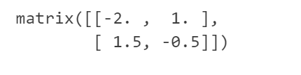

#  LINEARREGRESSOR

## DEMO10_LINEARREGRESSOR_FOR_PYTHON

```python
# 导入依赖项
import numpy as np
import pandas as pd
import matplotlib.pyplot as plt
```

```python
# 创建一个ndarray数组
arr = np.array([[1, 2], [3, 4]])
arr
```


```python
# 创建一个矩阵 - 在numpy中创建矩阵需要使用mat函数，该函数需要输入一个二维的ndarray数组
m = np.mat(arr)
m
```


```python
# 矩阵的转置
m.T
```

```python
# 矩阵的乘法
m * m
```


```python
# 获取当前方阵的行列式
np.linalg.det(m)
```

```python
# 求解方阵的逆矩阵
m.I
```



```python
# 手撕线性回归算法第一步：实现线性回归模型
def linearRegressorModels(dataset):
  
  '''
    构建线性回归模型
  '''
  
  # 1.从数据集中提取特征，构建为一个二维的矩阵
  xMat = np.mat(dataset.iloc[:, : -1].values)
  
  # 2.从数据集中提取标签 - 注意：在取标签的时候，是一个行向量，为了方便后续使用，需要转置为一个列向量
  yMat = np.mat(dataset.iloc[:, -1  ].values).T
  
  # 3.先计算xTx这个n阶方阵
  xTx = xMat.T * xMat
  
  # 对于n阶方阵而言，其方阵的逆矩阵是否存在的充分必要条件是方阵的行列式是否为0
  if np.linalg.det(xTx) == 0:
    print("矩阵的行列式为0，无法求逆，请检查数据集")
    return
  
  return xTx.I * (xMat.T * yMat)
```

```python
# 测试

# 设置随机种子
randoms = np.random.RandomState(123)

#生成100个0-5之间的随机数
x = 5 * randoms.rand(100)

# 生成真实规律的标签值
y = 2 * x - 5 + randoms.randn(100)

# 构造一个dataframe
x = pd.DataFrame(x)
y = pd.DataFrame(y)

# x还需要添加一个全为1的列，表示截距
col_1 = pd.DataFrame(np.ones([100, 1]))

# 最终按轴一方向，拼接得到最终的数据集
data = pd.concat([col_1, x, y], axis=1)
data.columns = ['inercept', 'features_1', 'target']
data
```


```python
# 输入数据集，完成线性回归模型的训练
w_result = linearRegressorModels(data)
w_result
```


```python
# 可视化

# 先获取预测结果
y_pred = data.iloc[:, :-1].values * w_result # 决策函数的推理

plt.plot(data.iloc[:, 1], data.iloc[:, 2], 'o') # 绘制原始数据样本的散点图
plt.plot(data.iloc[:, 1], y_pred) # 绘制一元线性回归的拟合直线
```


```python
# 实现SSE残差平方和模型评估指标
def SSE_cal(dataset, regres):
  
  '''
    计算SSE残差平方和模型评估指标
  '''
  
  # 1.先获取标签的观察值
  y = dataset.iloc[:, -1].values
  
  # 2.算出参数列向量w
  w = regres(dataset)
  
  # 3.获取标签的预测结果 - 结果整体转置
  y_pred = (dataset.iloc[:, :-1].values * w).flatten()
  
  return np.power(y_pred - y, 2).sum()  
```

```python
# 实现判定系数R^2模型评估指标
def r2_Square(dataset, regres):
  
  '''
    计算R^2判断系数
  '''
  
  # 1.先计算SSE残差平方和
  sse = SSE_cal(dataset, regres)
  
  # 2.获取标签的观察值
  y = dataset.iloc[:, -1].values

  # 3.计算观测均值差总平方和
  sst = np.power(y - y.mean(), 2).sum()
  
  return 1 - sse / sst
```

```python
r2_Square(data, linearRegressorModels)
```


```python
# 岭回归算法手撕Python实现

def linearRiddgeRegressorModels(dataset,lambdas = 0.0):
  
  '''
    构建岭回归模型
  '''
  
  # 1.从数据集中提取特征，构建为一个二维的矩阵
  xMat = np.mat(dataset.iloc[:, : -1].values)
  
  # 2.从数据集中提取标签 - 注意：在取标签的时候，是一个行向量，为了方便后续使用，需要转置为一个列向量
  yMat = np.mat(dataset.iloc[:, -1  ].values).T
  
  # 3.先计算xTx这个n阶方阵
  xTx = xMat.T * xMat
  
  # 对于给定的参数lambda，如果不为0就代表需要使用岭回归算法，即代表需要加入L2正则化项，即代表xTx需要加一个同型的n阶对角阵λ * E
  if lambdas != 0.0:
    
    # 加入L2正则化项 - numpy生成一个单位矩阵的方法np.eye(shape)
    matrixs = xTx + np.eye(xMat.shape[1]) * lambdas
    return matrixs.I * (xMat.T * yMat)
  else:
    
    # 如何λ等于0，假设直接表示不需要L2正则化，则直接返回空None
    return linearRegressorModels(dataset)
```

```python
# 测试  
# linearRiddgeRegressorModels(data, 0.00001)

# 使用普通多元线性回归构建一个模型，再使用加入了L2正则化项后的岭回归构建一个模型，采用相同的数据集，获得参数w计算结果后，对于二者模所得到的r^2分数
r2_Square(data, linearRiddgeRegressorModels)
```

## DEMO11_LINEARREGRESSOR_FOR_SKLEARN

```python
import numpy as np
import pandas as pd
import matplotlib.pyplot as plt

# 导入线性回归模型
from sklearn.linear_model import LinearRegression

# 导入数据集划分对象
from sklearn.model_selection import train_test_split

# 导入波士顿房价数据集
data_url = "http://lib.stat.cmu.edu/datasets/boston"
raw_df = pd.read_csv(data_url, sep="\s+", skiprows=22, header=None)
data = np.hstack([raw_df.values[::2, :], raw_df.values[1::2, :2]])
target = raw_df.values[1::2, 2]

# 导入回归模型的评估指标
from sklearn.metrics import mean_squared_error, r2_score  

from IPython.core.interactiveshell import InteractiveShell # 这个对象设置所有行全部输出
  
# 设置该对象ast_node_interactivity的属性值为all，表示notebook下每一行有输出的代码全部输出运算结果
InteractiveShell.ast_node_interactivity = "all"

# 解决坐标轴刻度负号乱码
plt.rcParams['axes.unicode_minus'] = False

# 解决中文乱码问题
plt.rcParams['font.sans-serif'] = ['Simhei']
plt.style.use('ggplot')
```

```python
# 加载数据
x = data
y = target
x.shape
```

```python
# 数据集划分
Xtrain, Xtest, Ytrain, Ytest = train_test_split(x, y, test_size=0.3, random_state=123)
```

```python
# 构建线性回归模型对象
reg = LinearRegression()

# 训练模型
reg = reg.fit(Xtrain, Ytrain)

# 模型预测
y_pred = reg.predict(Xtest)

# 模型评估
mean_squared_error(Ytest, y_pred)
r2_score(Ytest, y_pred)

# 查看当前回归模型的截距
reg.intercept_

# 查看当前回归模型的参数
reg.coef_
```

