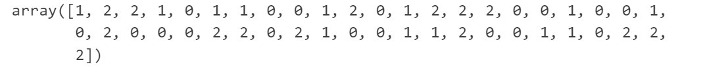

# LOGIC_REGRESSOR

## DEMO14_LOGIC_REGRESSOR_FOR_SKLEARN

```python
# 导包
import numpy as np
import pandas as pd
import matplotlib.pyplot as plt

from IPython.core.interactiveshell import InteractiveShell # 这个对象设置所有行全部输出

# 导入鸢尾花数据集
from sklearn.datasets import load_iris

# 导入数据集划分工具
from sklearn.model_selection import train_test_split

# 导入逻辑回归模型
from sklearn.linear_model import LogisticRegression

# 导入分类模型评估指标accuracy_score
from sklearn.metrics import accuracy_score

# 设置该对象ast_node_interactivity属性的值为all，表示在notebook下每一行有输出的代码全部输出运算结果
InteractiveShell.ast_node_interactivity = "all"

# 解决坐标轴刻度负号乱码
plt.rcParams['axes.unicode_minus'] = False

# 解决中文乱码问题
plt.rcParams['font.sans-serif'] = ['Simhei']
plt.style.use('ggplot')
```

```python
dataset  = load_iris()
x = dataset.data
y = dataset.target
```

```python
# 数据集划分
Xtrain, Xtest, Ytrain, Ytest = train_test_split(x, y, test_size=0.3, random_state=123)
```

```python
# 构建逻辑回归模型
clf = LogisticRegression()

# 训练模型
clf = clf.fit(Xtrain, Ytrain)

# 模型前向计算（预测）
y_pred = clf.predict(Xtest)
y_pred
```



```python
# 评估模型准确率
accuracy_score(y_pred, Ytest)
```


```python
# 获取预测结果的概率分布
clf.predict_proba(Xtest)
```

```python
# 查看截距
clf.intercept_

clf.coef_
```


## DEMO15_LOGIC_REGRESSOR_FOR_SKLEARN

```python
'''
Author: Szl
Date: 2024-04-07 15:53:15
LastEditors: Szl
LastEditTime: 2024-04-07 16:39:08
Description: 
'''

# Package and Modules import statements
# -----------------------
import torch
import torch.nn.functional as F

from torch import nn


# codings
# -----------------------

# 准备数据
n_items = 1000 # 训练数据的样本容量
n_features = 2 # 特征维度n，特征个数
learning_rate = 0.001 # 梯度下降的学习率α，步长
epchoes = 100 # 训练轮数

# create fake data
# 设置全局的随机种子
torch.manual_seed(123)

# 生成数据
data_x = torch.randn(size = (n_items, n_features)).float() # 返回的对象是tensor类型

# 生成标签
data_y = torch.where(torch.subtract(data_x[:, 0] * 0.5, data_x[:, 1] * 0.5) > 0, 1., 0.).float()
print(data_y)

# 构建逻辑回归模型对象
class LogisticRegressor(object):
  '''
    torch构建逻辑回归模型
  '''
  
  def __init__(self):
    
    # 准备回归参数w和偏置b
    self.w = torch.randn(size = (n_features, 1), requires_grad = True) # 准备一个参数列向量，向量中参数的个数保持与特征维度一致即可，requires_grad参数表示该参数是否需要进行梯度更新
    self.b = torch.zeros(size = (1, 1), requires_grad = True)

  # 定义前向计算过程，即一次predict
  def forward(self, x): # x表示一次传入的一条样本数据
    y_hat = F.sigmoid(torch.matmul(self.w.transpose(0, 1), x) + self.b) # 矩阵的乘法运算
    return y_hat
  
  # 定义损失函数loss
  @staticmethod
  def loss_func(y_hat, y):
    return -(torch.log(y_hat * y + (1 - y) * torch.log(1 - y_hat)))
  
  # 构建模型训练过程
  def train(self):
   
    # 100轮训练
    for epoch in range(epchoes):
    
      # 每一轮训练下，一次输入一条样本数据
      for step in range(n_items):
        
        # 循环内完成的是一次训练过程
        # 1.输入样本x，完成前向运算
        y_hat = self.forward(data_x[step])

        # 2.获取该样本的真实结果
        y = data_y[step]
        
        # 3.计算损失函数loss
        loss = self.loss_func(y_hat, y)
        
        # 4.损失函数开始进行梯度下降
        # 4.1.开始反向传播 - 反向传播 - 就是一次梯度下降
        loss.backward()
        
        # 4.2.更新参数 - 注意：需要梯度下降法进行凸优化的损失函数，切记其参数更新时所处的上下文环境不能存在梯度更新操作
        with torch.no_grad():
          
          # 4.3.实现参数更新
          self.w.data -= learning_rate * self.w.grad
          self.b.data -= learning_rate * self.b.grad
  
        # 4.4 注意：一旦参数更新完，一定要梯度归零，等待后续下次迭代时重新计算梯度
        self.w.grad.zero_()
        self.b.grad.zero_()
      print('epoch:{}, loss:{}'.format(epoch, loss.item()))

# run test UseCase if current modules in main
# -----------------------

if __name__ == '__main__':
  lr = LogisticRegressor()
  lr.train()
```

