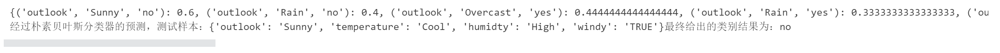
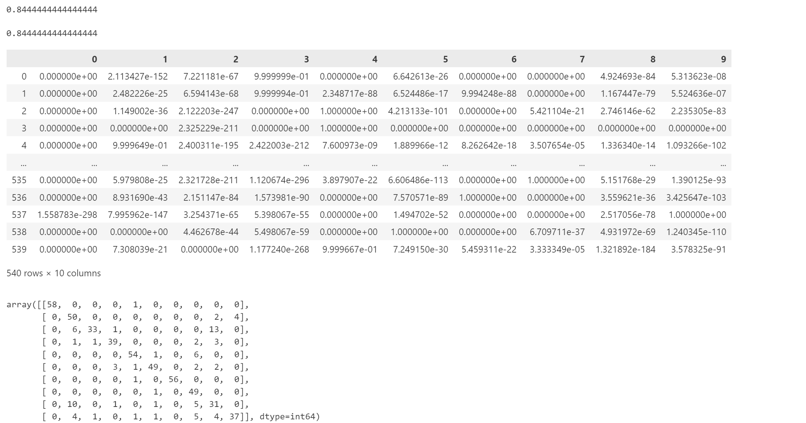

# NAIVE_BAYES

## DEMO08_NAIVE_BAYES_FOR_PYTHON

```python
# 导包
import numpy as np
import pandas as pd
import matplotlib.pyplot as plt

from IPython.core.interactiveshell import InteractiveShell # 这个对象设置所有行全部输出
  
# 设置该对象ast_node_interactivity的属性值为all，表示notebook下每一行有输出的代码全部输出运算结果
InteractiveShell.ast_node_interactivity = "all"

# 解决坐标轴刻度负号乱码
plt.rcParams['axes.unicode_minus'] = False

# 解决中文乱码问题
plt.rcParams['font.sans-serif'] = ['Simhei']
plt.style.use('ggplot')
```

```python
# fake data

# 室外天气
outlook = ['Sunny', 'Sunny', 'Overcast', 'Rain', 'Rain', 'Rain', 'Overcast', 'Sunny', 'Sunny', 'Rain', 'Sunny', 'Overcast', 'Overcast', 'Rain']

# 温度
temperature = ['Hot', 'Hot', 'Hot', 'Mild', 'Cool', 'Cool', 'Cool', 'Mild', 'Cool', 'Mild', 'Mild', 'Mild', 'Hot', 'Mild']

# 湿度
humidty = ['High', 'High', 'High', 'High', 'Normal', 'Normal', 'Normal', 'High', 'Normal', 'Normal', 'Normal', 'High', 'Normal', 'High']

# 是否有风
windy = ['FALSE', 'TRUE', 'FALSE', 'FALSE', 'FALSE', 'TRUE', 'TRUE', 'FALSE', 'FALSE', 'FALSE', 'TRUE', 'TRUE', 'FALSE', 'FALSE']

play = ['no', 'no', 'yes', 'yes', 'yes', 'no', 'yes', 'no', 'yes', 'yes', 'yes', 'yes', 'yes', 'no']
```

```python
# 将上述数据集构造为一个dataframe
dataset = pd.DataFrame(
  {
    'outlook' : outlook,
    'temperature' : temperature,
    'humidty' : humdity,
    'windy' : windy,
    'play' : play
  }
)
dataset
```

```python
# 数据切分，切分出所需的数据集和标签
y = dataset.iloc[:, -1]
x = dataset.drop(['play'], axis = 1)
```

```python
'''
Author: Szl
Date: 2024-04-01 09:04:32
LastEditors: Szl
LastEditTime: 2024-04-01 09:29:16
Description: 
'''
# 构建朴素贝叶斯分类器模型
def naiveBayesClassifier(x, y):
  
  '''
    构建一个朴素贝叶斯分类器模型
    :params x:输入的数据集，即一组简单随机样本
    :params y:输入的标签
  '''
  
  # 1.获取标签的所有类别
  classes = y.unique()
  # print(y.value_counts().index)
  # print(y.unique())
  
  # 2.统计样本中所属各个类别的样本的数量D(c)
  class_count = y.value_counts()
  # print(class_count) 
  
  # 3.先计算类先验概率：任意样本所属某类别的概率是多少，即计算类先验概率P(c)
  class_prior = class_count / len(y)
  
  # 5.准备一个空字典，等待保存计算得出的所有类条件概率
  priors = dict()
  
  # 4.接下来计算类条件概率P(x_i|c)
  for col in x.columns:
    
    # 每一列特征的取值下针对标签所有的类别开始计算类条件概率
    for j in classes:
      
      # 获取D_{c_ix_i} : 代码逻辑是：D_c这个样本集合中在第j个特征上的取值为x_i的样本总数
      p_x_y = x[(y == j).values][col].value_counts()
      # print(p_x_y)
      
      
      # 计算类条件概率P(x_i|c)
      for i in p_x_y.index:
        priors[(col, i, j)] = p_x_y[i] / class_count[j] 
        # 保存时需要达到的效果：要能知道当前计算得出的类条件概率到底是所属哪一个类别下的哪一个特征取到了哪一个值类条件概率
  
  print(priors)
  
  # 至此，计算后的所有结果都在priors这个字典中
  return classes, class_prior, priors      
        
naiveBayesClassifier(x, y)
```

```python
def predict(x_test):
  
  '''
    模型预测推理，传入一条测试集样本，通过朴素贝叶斯分类器给出分类的预测结果
  '''
  
  # 1.先获取训练完成后的模型
  classes, class_prior, priors = naiveBayesClassifier(x, y)
  
  # 准备一个字典，保存最终的预测结果
  result = dict()
  
  # 2.针对所有类别开始预测
  for c in classes:
    
    # 先获取类先验概率
    p_y = class_prior[c]
    
    # 准备连乘
    p_x_y = 1
    
    # 拿到测试集中的每一个特征
    for i in x_test.items():
      p_x_y *= priors[tuple(list(i) + [c])]
    
    # 最终完整计算，即得最终需要求解的后验概率P(x|c)
    result[c] = p_y * p_x_y # 这个结果就是已知样本x取到一个值，其所属c类别的概率，这个概率需要保存。所属c类别的概率是多少，需要借助字典结构来存储

  return result


def test():
  X_test = {'outlook' : 'Sunny', 'temperature' : 'Cool', 'humidty' : 'High', 'windy' : 'TRUE'}
  result = predict(X_test)
  # print(result)
  
  print('经过朴素贝叶斯分类器的预测，测试样本：{}最终给出的类别结果为：{}'.format(X_test, pd.Series(result).index[0]))
  
test()
```



## DEMO09_NAIVE_BAYES_FOR_SKLEARN

```python
# 导包
import numpy as np
import pandas as pd
import matplotlib.pyplot as plt

from IPython.core.interactiveshell import InteractiveShell # 这个对象设置所有行全部输出
  
# 设置该对象ast_node_interactivity的属性值为all，表示notebook下每一行有输出的代码全部输出运算结果
InteractiveShell.ast_node_interactivity = "all"

# 解决坐标轴刻度负号乱码
plt.rcParams['axes.unicode_minus'] = False

# 解决中文乱码问题
plt.rcParams['font.sans-serif'] = ['Simhei']
plt.style.use('ggplot')

# 导入依赖项
from sklearn.naive_bayes import GaussianNB

# 导入手写数字识别数据集
from sklearn.datasets import load_digits

# 数据集划分
from sklearn.model_selection import train_test_split

# 导入混淆矩阵
from sklearn.metrics import confusion_matrix as CM

# 导入分类模型准确率评估指标
from sklearn.metrics import accuracy_score
```

```python
# 加载数据集
dataset = load_digits()

x = dataset.data
y = dataset.target

# 划分数据集
Xtrain, Xtest, Ytrain, Ytest = train_test_split(x, y, test_size=0.3, random_state=123)
```

```python
# 构建高斯朴素贝叶斯分类器模型
gnb = GaussianNB().fit(Xtrain, Ytrain)

# 获取测试集的预测结果
y_pred = gnb.predict(Xtest)

# 使用accuracy_score评估模型
accuracy_score(y_pred, Ytest)

# 查看模型评分
gnb.score(Xtest, Ytest)

# 查看预测结果的概率分布
pd.DataFrame(gnb.predict_proba(Xtest))

# 混淆矩阵
CM(Ytest, y_pred)
```

